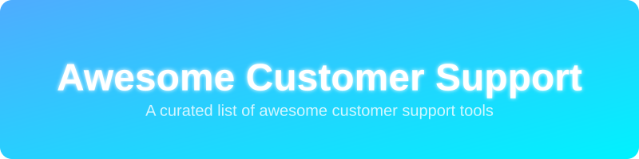

  
   
   
  <h1>Awesome Customer Support 🚀</h1>

A curated list of awesome customer support software, SaaS platforms, and open-source helpdesk solutions. This repository provides a comprehensive guide for customer service teams, support agents, and businesses looking to optimize their customer experience.

## ☁️ SaaS & Hosted Platforms

Explore the top commercial customer support platforms. The list is sorted by estimated company valuation.

| Product | Description | Est. Valuation / Size | Pricing (Starting Tier) | Free Tier / Trial Limit |
|---|---|---|---|---|
| **[Zendesk](https://www.zendesk.com/)** 🏢 | Leading omnichannel customer service and engagement platform. | ~$15B | $19 per agent/month (Support Team) | 14-day free trial (includes access to Suite Professional features) |
| **[Freshdesk](https://freshdesk.com/)** 🍃 | Intuitive, cloud-based helpdesk ticketing system by Freshworks. | ~$4B | $15 per agent/month (Growth Plan) | 6-month Free Program (max 2 agents, standard email & ticketing only) |
| **[Front](https://front.com/)** ✉️ | Collaborative team inbox and powerful customer communication platform. | ~$1.7B | $25 per seat/month (Starter Plan) | 14-day free trial (access to Professional plan features, no credit card required) |
| **[Intercom](https://www.intercom.com/)** 💬 | AI-first customer service platform and advanced messenger. | ~$1.3B | $29 per seat/month (Essential Plan) | 14-day free trial (includes core plan and premium add-ons access) |
| **[Help Scout](https://www.helpscout.com/)** 🤝 | Simple, shared inbox and highly intuitive knowledge base software. | ~$100M | $20 per user/month (Standard Plan) | Free Plan limit: up to 5 users, 1 shared inbox, 1 Docs site, 100 contacts/month. (15-day free trial for paid plans) |

## 🌐 Open-Source GitHub Projects

Self-hosted and open-source customer support alternatives. Ordered by GitHub stars (descending).

- **[Chatwoot](https://github.com/chatwoot/chatwoot)**  🌟  
  Open-source customer engagement suite, an alternative to Intercom, Zendesk, and Salesforce Service Cloud.
- **[Papercups](https://github.com/papercups-io/papercups)**  ☕  
  Open-source live customer chat, written in Elixir. Alternative to Intercom and Drift.
- **[Zammad](https://github.com/zammad/zammad)**  🎫  
  Web-based, open-source helpdesk/customer support system with many features to manage customer communication.
- **[FreeScout](https://github.com/freescout-helpdesk/freescout)**  🦅  
  Super lightweight free open-source help desk and shared inbox, heavily inspired by Help Scout.
- **[Chaskiq](https://github.com/chaskiq/chaskiq)**  💬  
  Open-source conversational marketing platform and live chat software built with Ruby on Rails.
- **[Helpy](https://github.com/helpyio/helpy)**  🆘  
  Open-source customer helpdesk in Ruby on Rails. Features a multichannel ticketing system and knowledgebase.
- **[Trudesk](https://github.com/polonel/trudesk)**  🛠️  
  Open-source helpdesk/ticketing solution built on Node.js and MongoDB.
- **[UVdesk](https://github.com/uvdesk/community-skeleton)**  📝  
  Enterprise-grade, open-source helpdesk system built for standard and e-commerce support.

## 🤝 Contribution Guidelines
Found a great customer support tool? Please feel free to open a pull request!
Check out the other awesome lists at [Awesome-Awesome-Awesome](https://github.com/ishandutta2007/Awesome-Awesome-Awesome).

## 📈 Star History

## Top Curriculum Management Tools Ecosystem

**Curated List of SaaS Products & Open-Source GitHub Projects**

*Focused on Curriculum Mapping, Unit Planning, Standards Alignment, Scope & Sequence, and Academic Program Management*

**Last updated: August 2026**

This repository tracks notable **SaaS platforms** and **open-source projects** for **Curriculum Management**. These tools help schools, districts, and higher-education institutions design, map, align, review, and continuously improve curriculum — including unit planning, standards alignment, scope-and-sequence management, and collaborative curriculum development.

**Examples** include Atlas Curriculum Management, Chalk Curriculum, ManageBac, Toddle, Eduplanet21, CourseLeaf Curriculum, Watermark Planning & Self-Study, OpenEduCat, Classter, and Blackbaud Curriculum (the category leaders and widely used platforms).

**Open-source emphasis**: Dedicated full-featured open-source curriculum mapping platforms are relatively scarce compared with LMS or SIS tools. This section highlights the strongest available open-source options for curriculum mapping, unit planning, standards alignment, and related education management systems that institutions can self-host and extend.

Contributions welcome! Open a PR to add/update entries. Keep descriptions factual and link to official sites / GitHub repos.

## Table of Contents

- [SaaS/Hosted Platforms](#saas-hosted-platforms)

- [Open-Source GitHub Projects](#open-source-github-projects)

- [How to Contribute](#how-to-contribute)

- [Disclaimer](#disclaimer)

## SaaS/Hosted Platforms

- **[Atlas Curriculum Management](https://www.rubicon.com/atlas-curriculum-management/)** (Rubicon)  

  Widely adopted curriculum mapping and management platform used by schools and districts for unit planning, standards alignment, and collaborative curriculum development.

- **[Chalk Curriculum](https://www.chalk.com/)**  

  Curriculum and instruction platform focused on planning, standards alignment, and making curriculum visible and actionable for teachers and leaders.

- **[ManageBac](https://www.managebac.com/)**  

  Popular platform for IB and international schools covering curriculum planning, assessment, reporting, and portfolio management.

- **[Toddle](https://www.toddleapp.com/)**  

  Modern, design-forward curriculum and learning platform strong in unit planning, progression tracking, and teacher collaboration (especially popular in progressive and international schools).

- **[Eduplanet21](https://www.eduplanet21.com/)**  

  Professional learning and curriculum platform supporting curriculum design, mapping, and educator development.

- **[CourseLeaf Curriculum](https://www.courseleaf.com/)**  

  Higher-education focused curriculum and catalog management solution used by universities for program and course governance.

- **[Watermark Planning & Self-Study](https://www.watermarkinsights.com/)**  

  Assessment, planning, and self-study tools that support curriculum review, accreditation, and continuous improvement processes.

- **[OpenEduCat](https://openeducat.org/)** (Enterprise / Cloud offerings)  

  Education ERP with strong curriculum, course, and academic management modules available in commercial deployments.

- **[Classter](https://www.classter.com/)**  

  All-in-one student and academic management platform that includes curriculum and academic structure capabilities.

- **[Blackbaud Curriculum](https://www.blackbaud.com/)** (and related academic solutions)  

  Part of Blackbaud’s education suite supporting curriculum and academic operations for independent schools and institutions.

- **[Rubicon Atlas](https://www.rubicon.com/)** / other established mapping tools  

  Additional commercial platforms frequently used for standards-based curriculum mapping and vertical/horizontal alignment.

## Open-Source GitHub Projects

- **[OpenEduCat](https://github.com/openeducat/openeducat_erp)**  

  Comprehensive open-source education ERP (LGPL) with modules for course/subject management, academic structure, curriculum planning elements, LMS features, and campus operations. One of the strongest open foundations for institutions wanting full academic control.

- **[TODCM](http://todcm.org/)** (Template Object Driven Curriculum Mapping)  

  Dedicated open-source curriculum mapping system supporting flexible unit templates (UbD, PYP, MYP, and custom formats), hierarchical standards/benchmarks, unit history, collaboration, and multiple search/mapping views.

- **[CurriculumStart](https://github.com/icarnaghan/CurriculumStart)**  

  Open-source curriculum mapping framework designed for Expeditionary Learning, Project-Based Learning, and traditional course models.

- **[Gibbon](https://github.com/GibbonEdu/core)**  

  Flexible open-source school platform that includes academic structure, departments, courses, and planning-related features usable for curriculum organization.

- **[RosarioSIS](https://github.com/FrancoisJacquet/rosariosis)** / **[openSIS](https://github.com/OS4ED/openSIS-Classic)**  

  Open-source student information systems that support academic scheduling, course management, and related curriculum structures.

- **[Frappe Education](https://github.com/frappe/education)** (and ERPNext Education)  

  Education module built on the Frappe framework offering academic program, course, and related management capabilities that can be extended for curriculum workflows.

- **[Moodle](https://github.com/moodle/moodle)** / **[Open edX](https://github.com/openedx)** / **[Canvas LMS Community](https://github.com/instructure/canvas-lms)**  

  Leading open-source learning management systems frequently used alongside or as delivery layers for curriculum, with varying degrees of planning and alignment support via plugins or custom development.

- **Oak Open Curriculum Ecosystem** (and related open curriculum data projects)  

  Tools, SDKs, and data resources around openly licensed, sequenced curriculum content that can support mapping, planning, and AI-assisted curriculum work.

- **SchoolTool** and other community school administration platforms  

  Additional open-source options that provide academic structure foundations institutions can build curriculum processes upon.

### Additional Strong Open-Source Options

- Custom curriculum mapping built on open CRMs, Notion-like tools, or low-code platforms using structured databases for units, standards, and alignments.

- Standards databases and alignment helpers that feed into mapping workflows.

- AI-assisted unit and lesson planning tools (emerging open projects) that generate draft maps aligned to frameworks.

- Integration of open LMS platforms with dedicated mapping spreadsheets or lightweight web apps for hybrid solutions.

- Higher-education catalog and program management tools built on open frameworks.

**Frameworks for building custom systems**: Many institutions combine **OpenEduCat** or another open SIS/ERP for academic structure with **TODCM** or custom unit templates for mapping, and an open LMS (**Moodle** / **Open edX**) for delivery. Standards alignment and reporting can be layered via SQL views, spreadsheets, or lightweight custom applications — resulting in a fully owned curriculum management stack.

## How to Contribute

1. Fork the repo.

2. Add/edit entries in `README.md` (follow existing format).

3. Include: name, link, 1–2 sentence description, and whether it's SaaS or open-source.

4. Submit PR with a short explanation.

Star the repo if you find it useful!

## Disclaimer

- This is a **community-curated** list — not exhaustive and not an endorsement.

- Curriculum management tools should be evaluated for standards framework support, collaboration features, reporting/alignment analytics, ease of teacher adoption, and total cost of ownership (including self-hosting and customization effort).

- Pure open-source curriculum mapping platforms are fewer than commercial offerings; many successful open implementations combine an education ERP/SIS with mapping-specific tools or custom development.

---

**Made for curriculum directors, instructional coaches, school leaders, and education technologists who want transparent, adaptable, and affordable curriculum management infrastructure.**

Let's make curriculum mapping, unit planning, and standards alignment more open, collaborative, and free from rigid proprietary systems.
